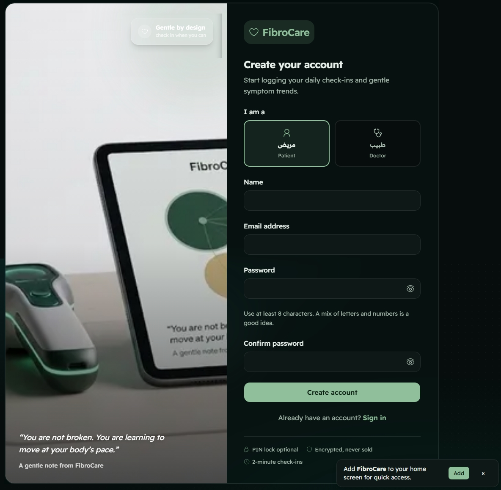
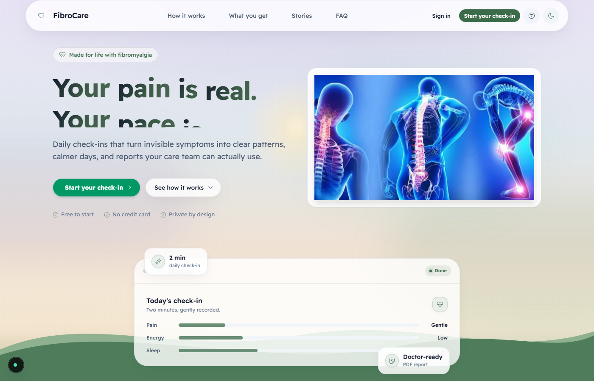
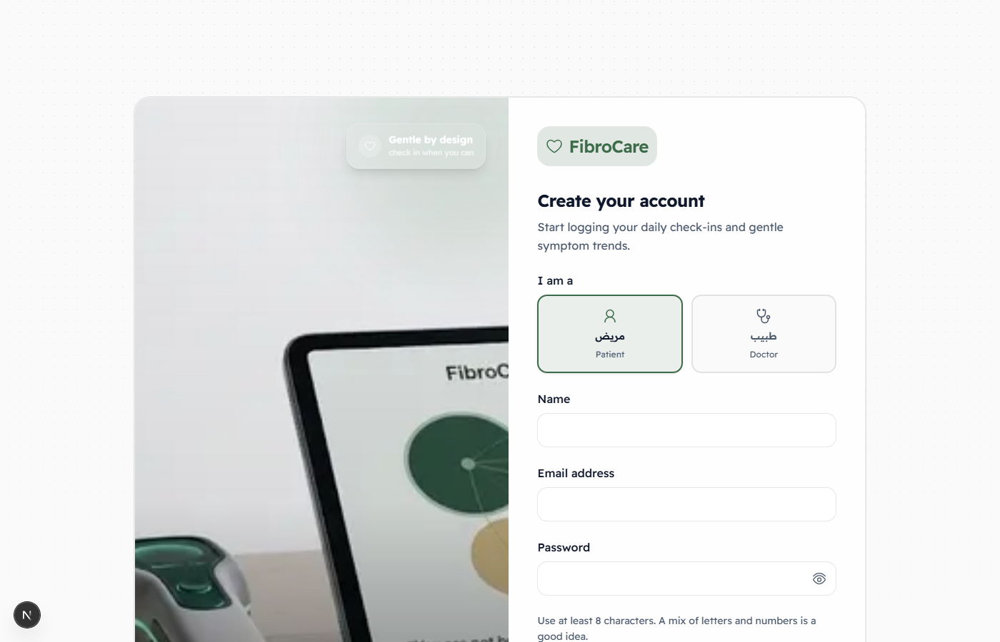
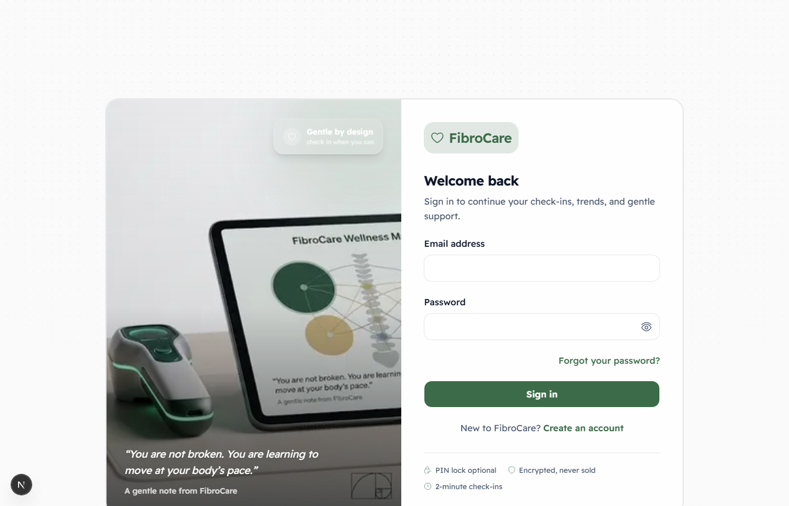

<div align="center">

# 🌿 FibroCare — معك في كل خطوة

**Your calm companion for chronic pain management, symptom tracking, and psychological support.**

---

[](https://nextjs.org/)
[](https://www.typescriptlang.org/)
[](https://tailwindcss.com/)
[](./LICENSE)
[](#testing)
[](#progressive-web-app)

</div>

---

## 📖 Overview

FibroCare is a **modern, AI-powered Progressive Web Application** designed for individuals living with chronic pain conditions — particularly fibromyalgia. It provides a calm, responsive, and deeply personalized environment for:

- **Daily symptom and pain tracking** with telemetry dashboards
- **Psychological support** through guided breathing, mindfulness prompts, and motivation widgets
- **AI-assisted health insights** grounded in clinical sources with zero-hallucination policies
- **Bilingual Arabic/English** support with full RTL layout handling

Built on **Next.js 16** with **React 19**, **Tailwind CSS 4**, and **TypeScript 5**, FibroCare installs as a **PWA** and works offline — keeping your health data private, on-device, and accessible whenever you need it.

---

## ✨ Core Features

### 🧘 Motivation & Psychological Support
- **Dynamic bilingual Motivation Widget** — rotating Quranic verses, Hadiths, and Hikmah (wisdom sayings) rendered in both Arabic and English with smooth animated transitions.
- **Guided Breathing Timer** — paced breathing exercises with visual cues and gentle audio prompts for flare-up management.
- **Spoon Energy Tracker** — energy-cost awareness for every daily activity to prevent overexertion and support sustainable pacing.

### 📊 Advanced Health Telemetry
- **Comprehensive Pain Dashboard** — interactive charts (Recharts) tracking pain levels, fatigue, sleep quality, mood, and medication adherence over time.
- **Flare Detection & Weather Correlation** — real-time OpenWeather API integration cross-referenced with logged flares, with barometric pressure trend analysis.
- **Automatic Fallback Indicators** — when live weather data is unavailable, deterministic estimated weather ensures the dashboard always renders usable data.

### 🤖 AI-Powered Assistance
- **Personalized AI Chat & Assistant** — conversational guidance powered by Vercel AI SDK with support for OpenAI, Anthropic Claude, and Google Gemini providers.
- **RAG-Grounded Insights** — all AI outputs are grounded in verified clinical sources (ACR, Mayo Clinic, NHS, EULAR) with a zero-hallucination policy.
- **1-Minute Summaries** — every resource page opens with a three-bullet AI takeaway written for cognitive fatigue, with a one-tap "Explain like I'm foggy" toggle.

### 📄 Reporting & Localization
- **Automated Arabic & English PDF Reports** — doctor-ready diagnosis summaries, 30-day health reports, and flare analyses generated via jsPDF with full RTL support.
- **Full Arabic/English i18n** — 700+ translation keys with dynamic locale switching, RTL logical properties (`ms-*`/`me-*`), and `<bdi>` isolation for embedded Latin text.
- **Doctor-Ready Export** — copyable summaries and downloadable PDF reports formatted for care team consumption.

### 🛡️ Privacy & Offline
- **Progressive Web App** — installs to your home screen with service worker caching and offline fallback pages.
- **On-Device Data** — SQLite database via Prisma ORM keeps your health data local by default.
- **Privacy PIN Lock** — 4-digit PIN gate for sensitive health data with encrypted session tokens.

### 🧪 Quality & Testing
- **Comprehensive Test Suites** — Vitest unit tests and Playwright end-to-end tests covering auth flows, API routes, and UI interactions.
- **Accessibility Auditing** — automated a11y CSS guards in CI, reduced-motion support, and contrast-sensitive design modes.

---

## 📸 Screenshots

<table align="center">
  <tr>
    <td align="center"></td>
    <td align="center"></td>
  </tr>
  <tr>
    <td align="center"><strong>Dashboard Overview</strong></td>
    <td align="center"><strong>Health Tracking</strong></td>
  </tr>
  <tr>
    <td align="center"></td>
    <td align="center"></td>
  </tr>
  <tr>
    <td align="center"><strong>AI Insights</strong></td>
    <td align="center"><strong>Resources</strong></td>
  </tr>
  <tr>
    <td align="center"></td>
    <td align="center"></td>
  </tr>
  <tr>
    <td align="center"><strong>Toolkit</strong></td>
    <td align="center"><strong>Reports</strong></td>
  </tr>
  <tr>
    <td align="center"></td>
    <td align="center"></td>
  </tr>
  <tr>
    <td align="center"><strong>Profile</strong></td>
    <td align="center"><strong>Zen Portal</strong></td>
  </tr>
  <tr>
    <td align="center" colspan="2"><hr></td>
  </tr>
  <tr>
    <td align="center"></td>
    <td align="center"></td>
  </tr>
  <tr>
    <td align="center"><strong>Homepage</strong></td>
    <td align="center"><strong>Dashboard</strong></td>
  </tr>
  <tr>
    <td align="center"></td>
    <td align="center"></td>
  </tr>
  <tr>
    <td align="center"><strong>Login</strong></td>
    <td align="center"><strong>Signup</strong></td>
  </tr>
  <tr>
    <td align="center"></td>
    <td align="center"></td>
  </tr>
  <tr>
    <td align="center"><strong>Toolkit</strong></td>
    <td align="center"><strong>Zen Portal</strong></td>
  </tr>
</table>

---

## 🛠️ Tech Stack

| Layer | Technology | Purpose |
|:---|:---|:---|
| **Framework** | [Next.js 16](https://nextjs.org/) (App Router) + React 19 | Server-side rendering, API routes, streaming |
| **Language** | [TypeScript 5](https://www.typescriptlang.org/) | Type safety, developer experience |
| **Styling** | [Tailwind CSS 4](https://tailwindcss.com/) + Framer Motion | Responsive design, glassmorphism, animations |
| **UI Components** | [shadcn/ui](https://ui.shadcn.com/) + Recharts | Accessible components, data visualization |
| **Database** | [Prisma](https://www.prisma.io/) ORM + SQLite | Local data persistence, type-safe queries |
| **Authentication** | [NextAuth.js](https://next-auth.js.org/) (v4) | JWT sessions, credentials + OAuth (Google/GitHub) |
| **AI/RAG** | [Vercel AI SDK](https://sdk.vercel.ai/) | Multi-provider LLM chat (OpenAI, Anthropic, Gemini) |
| **Weather** | [OpenWeather API](https://openweathermap.org/) | Live weather data with deterministic fallback |
| **PDF Generation** | [jsPDF](https://www.npmjs.com/package/jspdf) + jspdf-autotable | Arabic/English health reports |
| **Testing** | [Vitest](https://vitest.dev/) + [Playwright](https://playwright.dev/) | Unit tests, E2E browser tests |
| **PWA** | Service Worker + Manifest | Offline support, installability |
| **Deployment** | [Vercel](https://vercel.com/) | Serverless functions, edge network |

---

## 🚀 Quick Start

### Prerequisites

- **Node.js** ≥ 18.x
- **npm** ≥ 9.x (or pnpm/yarn)
- **Git**

### Installation

```bash
# 1. Clone the repository
git clone https://github.com/mariam423/fibrocare.git
cd fibrocare

# 2. Install dependencies
npm install

# 3. Configure environment variables
cp .env.example .env.local
```

### Environment Variables

Create a `.env.local` file at the project root. The app runs **fully functional with zero keys** — all AI insights, RAG grounding, and offline fallbacks work out of the box. Add keys only for live features:

```env
# ── Database (SQLite — works as-is) ──
DATABASE_URL="file:./dev.db"

# ── Weather (optional — dashboard falls back to deterministic estimates) ──
OPENWEATHER_API_KEY=your_openweather_api_key
OPENWEATHER_CITY=London

# ── Site URL (for SEO and social metadata) ──
NEXT_PUBLIC_SITE_URL=http://localhost:3000

# ── AI Care Companion (optional — any ONE key enables live chat) ──
# GEMINI_API_KEY=...        # recommended — free tier available
# OPENAI_API_KEY=...
# ANTHROPIC_API_KEY=...

# ── Auth (optional — enables Google/GitHub sign-in) ──
# NEXTAUTH_SECRET=your_random_secret_string
# NEXTAUTH_URL=http://localhost:3000
# GOOGLE_CLIENT_ID=...
# GOOGLE_CLIENT_SECRET=...
# GITHUB_CLIENT_ID=...
# GITHUB_CLIENT_SECRET=...
```

### Run Development Server

```bash
# Start the dev server with Turbopack
npm run dev
```

Open [http://localhost:3000](http://localhost:3000) in your browser.

---

## 🧪 Testing

```bash
# Run full Vitest unit test suite
npm test

# Run tests in watch mode
npm run test:watch

# Run Playwright end-to-end tests
npm run test:e2e

# Run tests against live AI providers
npm run test:e2e:live

# Type-check the project
npx tsc --noEmit

# Full production build + PWA service worker
npm run build

# Accessibility audit
npm run check:a11y
```

---

## 🏗️ Project Structure

```
fibrocare/
├── public/                    # Static assets (images, icons, fonts)
│   └── images/                # Screenshots and resource illustrations
├── src/
│   ├── app/                   # Next.js App Router pages & layouts
│   │   ├── api/               # API route handlers
│   │   │   ├── ai/            # AI-powered endpoints (insight, care-plan, etc.)
│   │   │   ├── auth/          # NextAuth route handlers
│   │   │   ├── chat/          # AI chat streaming endpoint
│   │   │   ├── weather/       # OpenWeather proxy with fallback
│   │   │   └── webhooks/      # Billing webhook handlers
│   │   ├── dashboard/         # Main health dashboard
│   │   ├── health-logs/       # Symptom and pain logging
│   │   ├── login/             # Authentication pages
│   │   ├── signup/            # User registration
│   │   ├── reports/           # PDF report generation
│   │   ├── resources/         # Educational content (About, FAQ, etc.)
│   │   ├── toolkit/           # Self-care toolkit (timers, exercises)
│   │   ├── pro/               # Doctor/professional portal
│   │   ├── profile/           # User profile management
│   │   ├── zen/               # Zen mindfulness portal
│   │   └── og/                # Open Graph image generation
│   ├── components/            # React UI components
│   ├── context/               # React context providers
│   ├── lib/                   # Utility modules (auth, AI, translations, weather)
│   └── proxy.ts               # Next.js 16 proxy (route protection)
├── prisma/                    # Database schema and migrations
├── scripts/                   # Build scripts, E2E runners, a11y audits
├── tests/                     # Playwright E2E test configurations
└── next.config.ts             # Next.js configuration (CSP, security headers)
```

---

## 🤝 Contributing

Contributions are welcome! FibroCare is built with care for the chronic pain community, and we appreciate help improving the experience.

### Guidelines

1. **Fork** the repository
2. **Create** a feature branch (`git checkout -b feature/amazing-feature`)
3. **Commit** your changes (`git commit -m 'feat: add amazing feature'`)
4. **Push** to the branch (`git push origin feature/amazing-feature`)
5. **Open** a Pull Request

### Before Submitting

```bash
npm test              # Ensure all unit tests pass
npm run test:e2e      # Run E2E tests
npx tsc --noEmit      # Verify no type errors
npm run build         # Confirm production build succeeds
```

### Commit Convention

This project follows [Conventional Commits](https://www.conventionalcommits.org/):

- `feat:` — new feature
- `fix:` — bug fix
- `docs:` — documentation changes
- `refactor:` — code restructuring without behavior change
- `test:` — adding or updating tests
- `chore:` — build, CI, or dependency changes

---

## ⚕️ Medical Disclaimer

> **FibroCare is a wellness and self-tracking tool — not a medical device, and never a substitute for professional care.** It does not diagnose, treat, or cure fibromyalgia. Always consult your physician or qualified healthcare provider about your symptoms and treatment plan.

AI-generated content is grounded in and cited against established clinical frameworks including ACR, Mayo Clinic, NHS, and EULAR guidelines. Where a claim cannot be verified, FibroCare shows a safe general note instead of generating ungrounded advice.

---

## 📄 License

This project is licensed under the **MIT License** — see the [LICENSE](./LICENSE) file for details.

---

<div align="center">

**Built with 💚 for the chronic pain community**

[⬆ Back to top](#-fibrocare---معك-في-كل-خطوة)

</div>
